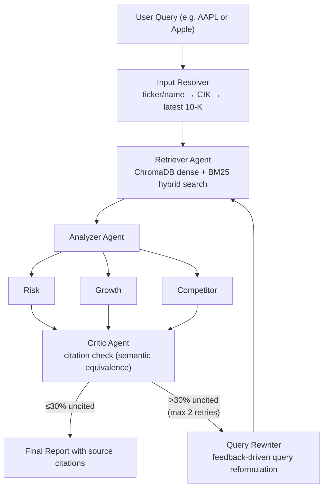
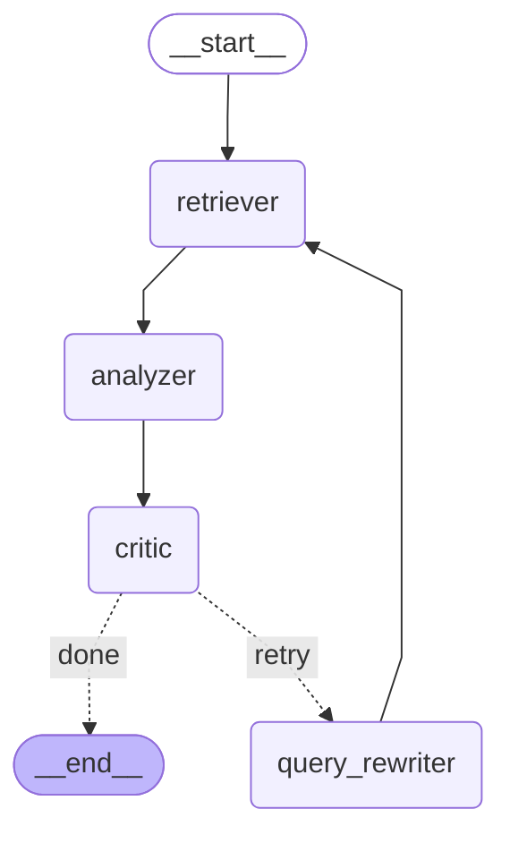

# finscope


> Analyse any public company's financial filings in seconds using a Multi-Agent RAG system powered by LangGraph.


> 📝 **Blog post:** [From arXiv to SEC: Building a Multi-Agent Financial Report Analyst with LangGraph](https://choeyunbeom.github.io/machine%20learning/nlp/finscope-multi-agent-financial-analyst/)

Ask questions like:
- *"What are Apple's key risk factors?"*
- *"Summarise Tesla's latest 10-K filing"*
- *"What does HSBC's annual report say about credit exposure?"*

finscope retrieves filings directly from **SEC EDGAR** and **Companies House**, then routes them through a 3-agent pipeline that delivers cited, hallucination-checked analysis.

---

## How It Works



---

## Tech Stack

| Layer | Choice | Why |
|---|---|---|
| Agent Orchestration | LangGraph | StateGraph with conditional retry edges |
| LLM | Groq (llama-3.3-70b) | Fast inference, free tier |
| Embedding | nomic-embed-text via Ollama | Local, no cost |
| Vector DB | ChromaDB | Zero-infra, persistent |
| Retrieval | Dense + BM25 hybrid + cross-encoder rerank | Better recall on financial jargon |
| PDF Parsing | pdfplumber | Handles financial tables |
| Backend | FastAPI | |
| UI | Streamlit | |
| Monitoring | Langfuse | LLM tracing (optional) |
| Data Sources | SEC EDGAR API, Companies House API | Free, legal, no scraping |

---

## Setup

```bash
# 1. Install dependencies
uv sync

# 2. Configure environment
cp .env.example .env
# Required: GROQ_API_KEY, SEC_EDGAR_USER_AGENT
# Optional: COMPANIES_HOUSE_API_KEY, LANGFUSE_PUBLIC_KEY, LANGFUSE_SECRET_KEY

# 3. Pull Ollama embedding model
ollama pull nomic-embed-text
```

---

## Run

```bash
# Start the API
uv run python -m uvicorn src.api.main:app --reload

# Launch the UI
uv run python -m streamlit run ui/app.py

# Run tests
uv run python -m pytest tests/ -v
```

### Docker

```bash
docker compose up
# API → http://localhost:8000
# UI  → http://localhost:8501
```

---

## Project Structure

```
finscope/
├── src/
│   ├── agents/
│   │   ├── graph.py            # LangGraph StateGraph (entry point)
│   │   ├── retriever.py        # Hybrid search node (with per-company caching)
│   │   ├── analyzer.py         # Parallel Risk / Growth / Competitor analysis
│   │   ├── critic.py           # Citation check + retry decision (semantic equivalence)
│   │   └── query_rewriter.py   # Feedback-driven query reformulation on retry
│   ├── ingestion/
│   │   ├── base.py             # BaseDocumentLoader
│   │   ├── sec_edgar.py        # SEC EDGAR API (10-K, 10-Q)
│   │   ├── companies_house.py
│   │   ├── indexer.py          # ChromaDB indexing pipeline
│   │   └── ingest.py           # CLI entrypoint
│   ├── retrieval/
│   │   ├── chunker.py          # 512-token chunks with financial metadata
│   │   └── hybrid_retriever.py # Dense + BM25 + RRF + rerank
│   └── api/
│       └── main.py             # FastAPI /analyze + async job endpoints
├── ui/
│   └── app.py                  # Streamlit demo
├── monitoring/
│   └── langfuse_config.py      # Optional Langfuse tracing
└── tests/
    ├── unit/                   # 24 unit tests — individual agent node logic
    └── integration/            # 11 integration tests — full LangGraph workflow scenarios
```

---

## LangGraph Diagram



---

## API Endpoints

| Method | Path | Description |
|---|---|---|
| `GET` | `/health` | Health check |
| `POST` | `/analyze` | Synchronous analysis (ingestion + multi-agent pipeline) |
| `POST` | `/analyze/async` | Submit async job, returns `job_id` for polling |
| `GET` | `/analyze/status/{job_id}` | Poll job status (`pending` → `ingesting` → `analyzing` → `completed`) |

For long-running analyses, use the async endpoint to avoid HTTP timeouts:
```bash
# Submit job
curl -X POST http://localhost:8000/analyze/async \
  -H "Content-Type: application/json" \
  -d '{"query": "What are Apple risk factors?", "company": "AAPL"}'
# → {"job_id": "a1b2c3d4e5f6", "status": "pending"}

# Poll status
curl http://localhost:8000/analyze/status/a1b2c3d4e5f6
```

---

## Results

Tested on Apple (AAPL) 10-K filing (2025-10-31):

| Metric | Result |
|---|---|
| Filing ingested | 575 chunks from HTML 10-K |
| Retrieval (hybrid) | 8 chunks retrieved per query |
| Critic verdict (typical) | `sufficient` on first pass |
| Analyzer latency | ~1.6s parallel vs ~4.9s sequential (**3.1x speedup**, measured, Groq llama-3.3-70b) |
| Unit tests | 24/24 passing |
| Integration tests | 11/11 passing |

---

## Critic Agent Evaluation

I tested whether the Critic Agent's LLM-as-Judge approach actually catches hallucinations by running synthetic test cases (clean, hallucinated, and borderline analyses) against real AAPL 10-K source chunks.

**Baseline (without Critic):** hallucinated analyses averaged **92% uncited claims** (23/25 claims, 3 cases). Without the Critic, these pass through to the final report unchanged.

| Metric | 70B (llama-3.3-70b) | 8B (llama-3.1-8b) |
|---|---|---|
| Sensitivity (hallucination detection) | **100%** (3/3) | 67% (2/3) |
| Specificity (clean pass-through) | 67% (2/3) | 67% (2/3) |
| Accuracy | **83%** | 67% |
| Borderline detection (~30% altered) | 3/3 caught | 0/3 caught |
| Avg uncited in hallucinated cases (baseline) | **92%** | **92%** (same input) |

Key findings:
- **Without the Critic, 92% of claims in hallucinated outputs are unsupported** — the Critic (70B) catches 100% of these cases and blocks them from reaching the user.
- **Model size matters significantly** — 70B catches all hallucinations and borderline cases; 8B misses both.
- **False positives exist** — both models occasionally flag clean analyses as insufficient (paraphrased content treated as uncited).
- All experiment runs are traced in **Langfuse** for reproducibility.

Full report: [`docs/REPORT.md`](docs/REPORT.md)

### Evaluation Limitations

- **Small scale:** n=18 synthetic cases total (proof-of-concept, not a production benchmark)
- **Circular evaluation:** test cases were generated by the same model family (llama-3.3-70b) used as the Critic judge — high accuracy partly reflects same-model pattern matching, not true generalisation
- **Absolute figures are upper bounds:** sensitivity/specificity should be read as best-case estimates under these conditions
- **The 70B vs 8B differential is the more robust signal** — model size effect holds regardless of circular evaluation bias
- **Future work:** human-annotated ground truth from naturally occurring hallucinations in real analyst reports

---

## What's Different from arXiv RAG

| | [arXiv RAG](https://github.com/choeyunbeom/arxiv_rag_system) | finscope |
|---|---|---|
| Domain | Academic papers | Financial filings (10-K, annual reports) |
| Agent architecture | Single-agent | Multi-agent (Retriever → Analyzer → Critic) |
| Analysis | Single Q&A | Parallel Risk / Growth / Competitor |
| Hallucination check | None | Critic agent with citation check + retry loop |
| Data sources | arXiv API | SEC EDGAR + Companies House |
| Chunking | Default | 512-token with financial metadata |

---

## Background

Extended from [arxiv_rag_system](https://github.com/choeyunbeom/arxiv_rag_system) — same hybrid retrieval pipeline, adapted for financial filings instead of academic papers.

Blog post: [From arXiv to SEC: Building a Multi-Agent Financial Report Analyst with LangGraph](https://choeyunbeom.github.io/machine%20learning/nlp/finscope-multi-agent-financial-analyst/)
