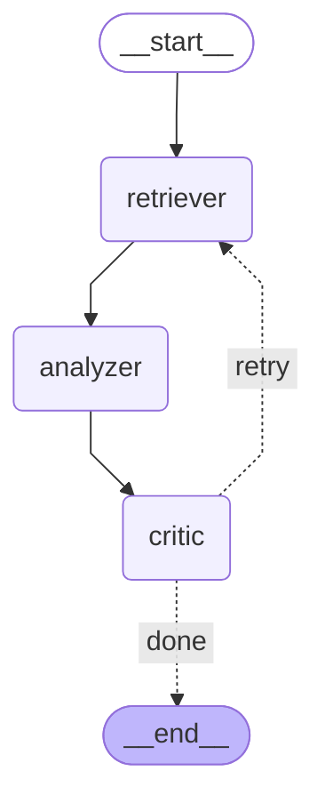

# finscope


> Analyse any public company's financial filings in seconds using a Multi-Agent RAG system powered by LangGraph.


> 📝 **Blog post:** [From arXiv to SEC: Building a Multi-Agent Financial Report Analyst with LangGraph](https://choeyunbeom.github.io/posts/finscope-multi-agent-rag/)

Ask questions like:
- *"What are Apple's key risk factors?"*
- *"Summarise Tesla's latest 10-K filing"*
- *"What does HSBC's annual report say about credit exposure?"*

finscope retrieves filings directly from **SEC EDGAR** and **Companies House**, then routes them through a 3-agent pipeline that delivers cited, hallucination-checked analysis.

---

## How It Works

```
User Query (e.g. "AAPL" or "Apple")
    ↓
[Input Resolver] — ticker/name → CIK → latest 10-K
    ↓
[Retriever Agent] — ChromaDB dense + BM25 hybrid search
    ↓
[Analyzer Agent] — Risk / Growth / Competitor (runs in parallel)
    ↓
[Critic Agent] — citation check → retry if >30% uncited (max 2x)
    ↓
Final Report with source citations
```

---

## Tech Stack

| Layer | Choice | Why |
|---|---|---|
| Agent Orchestration | LangGraph | StateGraph with conditional retry edges |
| LLM | Groq (llama-3.3-70b) | Fast inference, free tier |
| Embedding | nomic-embed-text via Ollama | Local, no cost |
| Vector DB | ChromaDB | Zero-infra, persistent |
| Retrieval | Dense + BM25 hybrid + cross-encoder rerank | Better recall on financial jargon |
| PDF Parsing | pdfplumber | Handles financial tables |
| Backend | FastAPI | |
| UI | Streamlit | |
| Monitoring | Langfuse | LLM tracing (optional) |
| Data Sources | SEC EDGAR API, Companies House API | Free, legal, no scraping |

---

## Setup

```bash
# 1. Install dependencies
uv sync

# 2. Configure environment
cp .env.example .env
# Required: GROQ_API_KEY, SEC_EDGAR_USER_AGENT
# Optional: COMPANIES_HOUSE_API_KEY, LANGFUSE_PUBLIC_KEY, LANGFUSE_SECRET_KEY

# 3. Pull Ollama embedding model
ollama pull nomic-embed-text
```

---

## Run

```bash
# Ingest a company's latest 10-K
uv run python -m src.ingestion.ingest --company "Apple" --source sec --filing 10-K
uv run python -m src.ingestion.ingest --company "AAPL" --source sec --filing 10-K

# Start the API
uv run python -m uvicorn src.api.main:app --reload

# Launch the UI
uv run python -m streamlit run ui/app.py

# Run tests
uv run python -m pytest tests/ -v
```

### Docker

```bash
docker compose up
# API → http://localhost:8000
# UI  → http://localhost:8501
```

---

## Project Structure

```
finscope/
├── src/
│   ├── agents/
│   │   ├── graph.py          # LangGraph StateGraph (entry point)
│   │   ├── retriever.py      # ChromaDB vector search node
│   │   ├── analyzer.py       # Parallel Risk / Growth / Competitor analysis
│   │   └── critic.py         # Citation check + retry decision
│   ├── ingestion/
│   │   ├── base.py           # BaseDocumentLoader
│   │   ├── sec_edgar.py      # SEC EDGAR API (10-K, 10-Q)
│   │   ├── companies_house.py
│   │   ├── indexer.py        # ChromaDB indexing pipeline
│   │   └── ingest.py         # CLI entrypoint
│   ├── retrieval/
│   │   ├── chunker.py        # 512-token chunks with financial metadata
│   │   └── hybrid_retriever.py  # Dense + BM25 + RRF + rerank
│   └── api/
│       └── main.py           # FastAPI /analyze endpoint
├── ui/
│   └── app.py                # Streamlit demo
├── monitoring/
│   └── langfuse_config.py    # Optional Langfuse tracing
└── tests/
    └── unit/                 # 24 unit tests (24/24 passing)
```

---

## LangGraph Diagram



---

## Results

Tested on Apple (AAPL) 10-K filing (2025-10-31):

| Metric | Result |
|---|---|
| Filing ingested | 575 chunks from HTML 10-K |
| Retrieval (hybrid) | 8 chunks retrieved per query |
| Critic verdict (typical) | `sufficient` on first pass |
| End-to-end latency | ~15s (Groq llama-3.3-70b, 3 parallel analyses) |
| Unit tests | 24/24 passing |

---

## What's Different from arXiv RAG

| | [arXiv RAG](https://github.com/choeyunbeom/arxiv_rag_system) | finscope |
|---|---|---|
| Domain | Academic papers | Financial filings (10-K, annual reports) |
| Agent architecture | Single-agent | Multi-agent (Retriever → Analyzer → Critic) |
| Analysis | Single Q&A | Parallel Risk / Growth / Competitor |
| Hallucination check | None | Critic agent with citation check + retry loop |
| Data sources | arXiv API | SEC EDGAR + Companies House |
| Chunking | Default | 512-token with financial metadata |

---

## Background

Extended from [arxiv_rag_system](https://github.com/choeyunbeom/arxiv_rag_system) — same hybrid retrieval pipeline, adapted for financial filings instead of academic papers.

Blog post: [From arXiv to SEC: Building a Multi-Agent Financial Report Analyst with LangGraph](https://choeyunbeom.github.io/machine%20learning/nlp/finscope-multi-agent-financial-analyst/)
